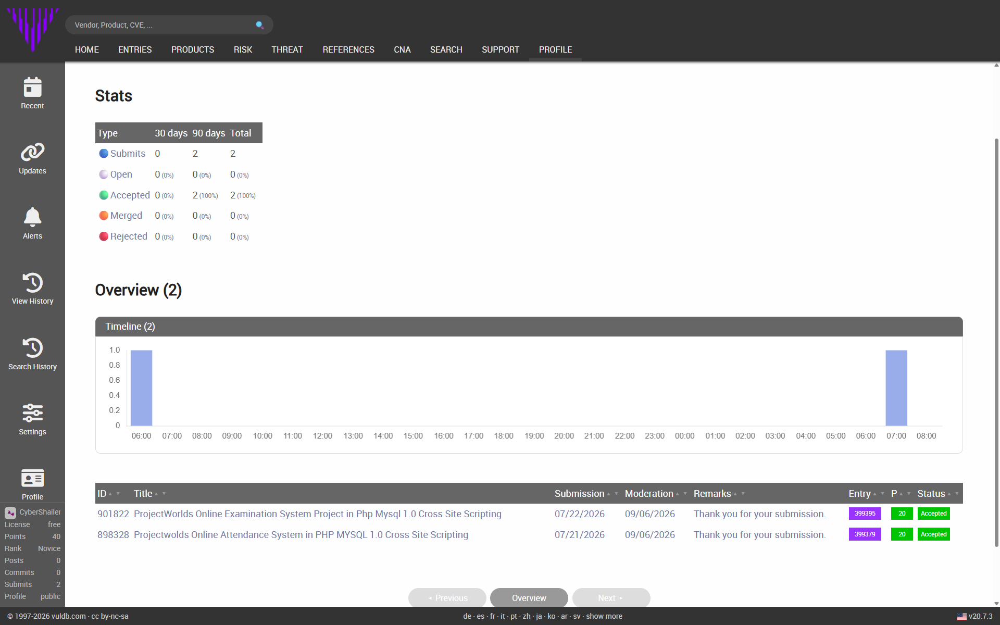

# From Recon to CVE: How I Found and Reported Two XSS Vulnerabilities in ProjectWorlds PHP Projects

**Author:** Shailendra Mourya (cybershailendra)

**LinkedIn:** https://www.linkedin.com/in/cybershailendra

**YouTube:** https://www.youtube.com/@cybershailendra

**OpenBugBounty:** https://www.openbugbounty.org/researchers/cybershailendra/

**By Shailendra Mourya (CyberShailendra)**
Email: cybershailendra1@gmail.com

Getting a bug bounty report accepted is satisfying. Getting **two CVEs confirmed in one week** is even better. This post walks through how I found, verified, and responsibly disclosed two Cross-Site Scripting (XSS) vulnerabilities in open-source PHP/MySQL projects from ProjectWorlds — both now tracked as official CVEs.

## The Targets

Both projects are popular open-source PHP/MySQL applications commonly used by students and small institutions, which also makes them widely deployed and under-audited:

## Project 

           1.Online Attendance System (PHP/MySQL) v1.0

           2. Online Examination System Project (PHP/MySQL) v1.0
## Vulnerability 

            1.Cross-Site Scripting
            
            2.Cross-Site Scripting
## VulDB Entry 

            1.VDB-399379

            2.VDB-399395
## CVE ID

            1.CVE-2026-86226

            2.CVE-2026-86238

## Why These Targets

Student/academic PHP-MySQL projects (attendance systems, examination portals, hospital/library management systems, etc.) are a recurring source of real CVEs. They're built quickly, rarely reviewed for security, and often reused across dozens of forks and college submissions — meaning a single flaw class tends to repeat across the whole family of projects. That repetition is exactly what makes them a productive hunting ground for a researcher building up a CVE portfolio.

## My Process: Recon → Verify → Disclose → Submit

**1. Recon (Source Review)**
Since these are open-source PHP projects available on GitHub, I didn't need to black-box test a live instance. I pulled the source and went straight to the input-handling logic — form fields, search parameters, feedback/comment sections, and any place user input gets echoed back into HTML without sanitization.

**2. Spotting the Injection Point**
Classic reflected/stored XSS pattern: user-controlled input (name, subject, remarks, search query, etc.) gets written directly into the page output using something like `echo $_POST['field']` or embedded straight into an HTML attribute/tag, with no `htmlspecialchars()`, no output encoding, and no input filtering.

**3. Proof of Concept**
For each finding, I crafted a minimal PoC payload to confirm script execution in the browser context — enough to demonstrate impact (session/cookie theft, defacement, phishing pivot) without weaponizing it further, in line with responsible disclosure norms.

**4. Documentation**
Every submission needs to stand on its own for a third-party reviewer, so I documented:
- Affected file(s) and exact vulnerable parameter
- Root cause (missing output encoding / input validation)
- Step-by-step reproduction
- Impact statement
- A public disclosure reference (GitHub repo) so others can verify independently

**5. Submission to VulDB**
I submitted both write-ups through VulDB's submission portal. VulDB explicitly warns about backlog delays ("we receive large quantities of vulnerability reports"), so patience is part of the process — both of mine sat in review for roughly 6–7 weeks before acceptance.

**The Review Timeline (Straight from My Submissions Dashboard)**
Patience really was tested here — the "My Submits" tracker showed four distinct status updates before final acceptance:

1. *"A very high amount of new submits is delaying processing... Current holidays might delay processing."* — the queue was simply backed up.
2. *"We are trying to handle this submit as quickly as possible... Current holidays might delay processing."* — still in the general processing queue.
3. *"Additional quality control in progress, please remain patient."* — the entry moved into VulDB's internal QC review.
4. *"Asked external party again for feedback (e.g. researcher, vendor, MITRE)... please remain patient."* — VulDB looped in outside parties (potentially the vendor or MITRE) for a second opinion before finalizing.

Only after this four-stage pipeline — queue → processing → QC → external feedback — did both entries land as accepted CVEs. It's a good reminder that a "submitted" report isn't a dead end; it's moving through real verification steps even when the tracker looks quiet for weeks.

**6. Acceptance + CVE Assignment**
Both entries came back accepted, each promoted straight to a CVE:
- Submit #898328 → VDB-399379 → **CVE-2026-86226**
- Submit #901822 → VDB-399395 → **CVE-2026-86238**

VulDB pushes accepted entries to the official CVE stream, which then takes up to 24 hours to reflect on cve.org and nvd.nist.gov.

## Lessons for Other Researchers

- **Open-source student projects are underrated targets.** They're realistic, legally safe to test (no live production system involved), and the vulnerability classes map directly to real-world mistakes.
- **Documentation quality matters as much as the bug itself.** A vague report gets bounced; a report with root cause, PoC, and a public disclosure link gets accepted faster.
- **Patience is part of the workflow.** VulDB's queue means acceptance isn't instant — track your submissions and don't resubmit duplicates while waiting.
- **One vulnerability class, many targets.** If a codebase has one unsanitized input, check every other form/field in the same project — and check sibling projects from the same source, since these are frequently cloned/forked.

## What's Next

Two more CVEs added to the researcher profile, two more real-world PHP applications a little safer for anyone still running them. The recon-to-disclosure pipeline keeps getting refined with every submission — next up is applying the same systematic review to a fresh batch of open-source PHP targets.

---

*Shailendra Mourya (CyberShailendra) is an independent security researcher and bug bounty hunter with 35+ responsible vulnerability disclosures across web and Android targets.*

**Contact:** cybershailendra.cyou
